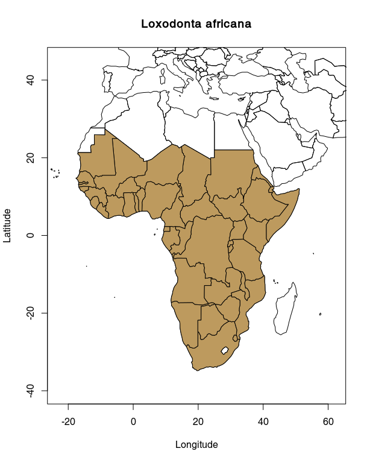

‘citesr’: R client for the CITES species+ API
=============================================

An R package to access the CITES Species+ database. Reference: UNEP
(2017). The Species+ Website. Nairobi, Kenya. Compiled by UNEP-WCMC,
Cambridge, UK. Available at: www.speciesplus.net. \[Accessed
11/03/2018\].

Current Status
--------------

How it works
------------

### Get a token

So far, the user must get its own authentication token, *i.e.* the user
must sign up on the species+/cites website:
<https://api.speciesplus.net/>. Once the token obtain, the user has
three options:

1.  set an environment variable `SPPPLUS_TOKEN` in
    [`.Renviron`](https://stat.ethz.ch/R-manual/R-devel/library/base/html/Startup.html)
    file (preferred);

2.  use `sppplus_login()`, *i.e.* interactively set `SPPPLUS_TOKEN` up
    for the current R session (meaning you will have to do it again
    during the next session);

3.  use the `token` argument of the functions, *i.e.* pass the token to
    every function calls.

For the sack of clarity we use a variable `token` below. If option 1 or
2 has been chosen then this parameter could be ignored (*i.e.* the
default value `token=NULL` will be used). Note that `8QW6Qgh57sBG2k0gtt`
used in what is following is not working, it is actually the token
displayed on the species+/cites API website, see
<https://api.speciesplus.net/documentation>.

### Installation of the R client

So far, the installation requires the `devtools` package:

    devtools::install_github("ibartomeus/citesr")
    library("citesr")
    mytoken <- "8QW6Qgh57sBG2k0gtt"
    # alternatively, use `sppplus_login()` and ignore `token`

### Examples

#### `sppplus_taxonconcept()`

    # retrieve a taxon concept id and more
    sppplus_taxonconcept(query = "Loxodonta africana", token = mytoken)

    #R>  $all
    #R>       id          full_name        author_year    rank name_status
    #R>  1: 4521 Loxodonta africana (Blumenbach, 1797) SPECIES           A
    #R>                   updated_at active cites_listing cites_listings
    #R>  1: 2018-01-31T10:04:10.239Z   TRUE          I/II         <list>
    #R>  
    #R>  $synonyms
    #R>        id          full_name      author_year    rank
    #R>  1: 37069 Loxodonta cyclotis (Matschie, 1900) SPECIES
    #R>  
    #R>  $common_names
    #R>                           name language
    #R>   1:                   Olifant       AF
    #R>   2:                       Fel       AR
    #R>   3:                       Fil       AZ
    #R>   4:                      Slon       BE
    #R>   5:                      Slon       BG
    #R>   6:                  Elefante       CA
    #R>   7:                      Slon       CS
    #R>   8:         afrikansk elefant       DA
    #R>   9:                   Elefant       DA
    #R>  10:     Afrikanischer Elefant       DE
    #R>  11:                 Elefantas       EL
    #R>  12:          African Elephant       EN
    #R>  13: African Savannah Elephant       EN
    #R>  14:                   Elevant       ET
    #R>  15:                     Norsu       FI
    #R>  16:              Afrikannorsu       FI
    #R>  17:                 Elefantti       FI
    #R>  18:        Eléphant d'Afrique       FR
    #R>  19:         Eléphant africain       FR
    #R>  20:                    Hathis       HI
    #R>  21:                    Haathi       HI
    #R>  22:                      Fill       IS
    #R>  23:         Elefante africano       IT
    #R>  24:                    Domrey       KM
    #R>  25:                   Elefant       NO
    #R>  26:                      Slon       RU
    #R>  27:         Elefante africano       ES
    #R>  28:                     Ndovo       SW
    #R>  29:                     Tembo       SW
    #R>  30:         afrikansk elefant       SV
    #R>  31:                    Haathi       UR
    #R>  32:                  Elefante       PT
    #R>  33:                  Elefante       EU
    #R>  34:                      Slon       HR
    #R>  35:                     Piugh       HY
    #R>  36:                   Olifant       NL
    #R>  37:        Afrikaanse olifant       NL
    #R>                           name language
    #R>  
    #R>  $higher_taxa
    #R>               V1
    #R>  1:     Animalia
    #R>  2:     Chordata
    #R>  3:     Mammalia
    #R>  4:  Proboscidea
    #R>  5: Elephantidae

    # also works at higher order taxonomy
    sppplus_taxonconcept(query = "Mammalia", appendix_only = TRUE, token = mytoken)

    #R>     id full_name cites_listing
    #R>  1: 34  Mammalia   I/II/III/NC

#### `sppplus_distribution()`

    # get distribution information
    dis <- taxon_distribution(tax_id = "4521", collapse_tags = " + ", token = mytoken)
    head(dis)

    #R>       id iso_code2              name tags    type references
    #R>  1: 1778        ML              Mali NULL COUNTRY     <list>
    #R>  2: 1923        GQ Equatorial Guinea NULL COUNTRY     <list>
    #R>  3: 4429        RW            Rwanda NULL COUNTRY     <list>
    #R>  4: 4491        GH             Ghana NULL COUNTRY     <list>
    #R>  5: 5628        SD             Sudan NULL COUNTRY     <list>
    #R>  6: 6724        ET          Ethiopia NULL COUNTRY     <list>

#### `taxon_cites_legislation()`

    # you can ask for the CITES legislation information, e.g. listings
    leg <- taxon_cites_legislation(tax_id = "4521", type = "listings", token = mytoken)
    leg$cites_listings[1L, 1L:6L]

    #R>       id taxon_concept_id is_current appendix change_type effective_at
    #R>  1: 3666             4521       TRUE       II           +   2007-09-13

#### `taxon_eu_legislation()`

    # you can ask for the CITES legislation information
    leg_eu <- taxon_eu_legislation(tax_id = "4521", type = "decisions", token = mytoken)
    leg_eu$eu_decisions[1L, 1L:6L]

    #R>        id taxon_concept_id notes start_date is_current eu_decision_type
    #R>  1: 26285             4521       2015-04-09       TRUE           <list>

    unlist(leg_eu$eu_decisions[1L, 6L])

    #R>  eu_decision_type.name eu_decision_type.type 
    #R>             "Positive"    "POSITIVE_OPINION"

#### `taxon_references()`

Note that `simplify = TRUE` simplifies the structure of the output.

    ref <- taxon_references(tax_id = '4521', type = 'taxonomic', token = mytoken)
    ref$taxonomic$citation[1L]

    #R>  [[1]]
    #R>  [1] "Anon. 1978. Red data book: Mammalia. IUCN. Morges."

#### Distribution map

The example below requires the package `rworldmap`.

    suppressPackageStartupMessages(library(rworldmap))
    map1 <- as.data.frame(taxon_distribution('4521', mytoken))
    map2 <- joinCountryData2Map(map1, joinCode="ISO2", nameJoinColumn = "iso_code2", nameCountryColumn = "name")

    #R>  42 codes from your data successfully matched countries in the map
    #R>  0 codes from your data failed to match with a country code in the map
    #R>  201 codes from the map weren't represented in your data

    map2@data$iso2 <- unlist(lapply(map2$iso_code2, is.null))
    plot(c(-23, 62), c(45, -40), type = "n", main = "Loxodonta africana",
      xlab = "Longitude (°C)", ylab = "Latitude (°C)")
    plot(map2, add = T)
    plot(map2[!map2$iso2,], col = "#bd9a5e", add = T)

Contributors
------------

### Code contributors

<https://github.com/ibartomeus/citesr/graphs/contributors>

### All contributors

-   Reporting issues: [FVFaleiro](https://github.com/FVFaleiro);

Ressources
----------

-   The structure of this repo/package was inspired by
    [taxize](https://github.com/ropensci/taxize);
-   Managing secret very helpful vignette
    <https://cran.r-project.org/web/packages/httr/vignettes/secrets.html>.

Code of Conduct
---------------

Please note that this project is released with a [Contributor Code of
Conduct](CONDUCT.md). By participating in this project you agree to
abide by its terms.
