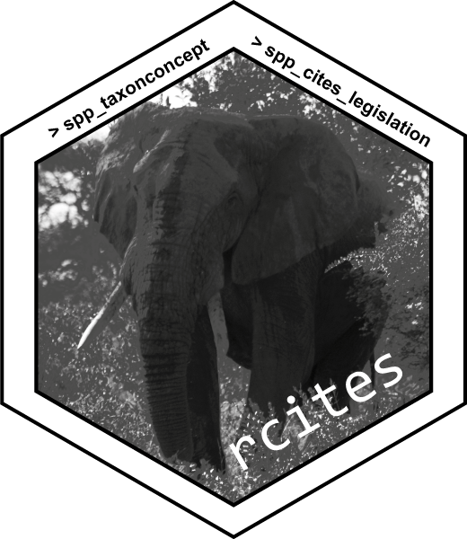

# rcites 

[](https://github.com/ropensci/rcites/actions/workflows/R-CMD-check.yaml)
[](https://app.codecov.io/gh/ropensci/rcites)
[](https://CRAN.R-project.org/package=rcites)
[](https://www.repostatus.org/#active)
[](https://github.com/ropensci/software-review/issues/244)
[](https://CRAN.R-project.org/package=rcites)
[](https://cran.r-project.org/package=rcites)
[](https://zenodo.org/badge/latestdoi/113842199)
[](https://doi.org/10.21105/joss.01091)


An R package to access information from the [Speciesplus](https://speciesplus.net/) database via the [Speciesplus/CITES Checklist API](https://api.speciesplus.net/documentation/v1.html). The package is available for download from [CRAN](https://cran.r-project.org/package=rcites) (stable version) and [Github](https://github.com/ropensci/rcites) (development version).

Please see the [release paper](https://doi.org/10.21105/joss.01091) for background information about the Convention on International Trade in Endangered Species of Wild Fauna and Flora ([CITES](https://cites.org/eng)), the Speciesplus database and basic information about the aim of the package.


### Installation

The package can be installed from CRAN:

```R
install.packages("rcites")
```

The development version can be installed via the [`remotes`](https://CRAN.R-project.org/package=remotes) :package:

```R
remotes::install_github("ropensci/rcites")
```


### Setup requirements and use

To set up a connection to the CITES Speciesplus database, a personal authentication token is required. Please see the vignette for details how to get a token and how to set the token for package use: [Get started with rcites](https://docs.ropensci.org/rcites/articles/a_get_started.html)

Additional information about specific use examples are provided for the
[African bush elephant (*Loxodonta africana*)](https://docs.ropensci.org/rcites/articles/b_elephant.html).
The package usage for querying multiple species is described in another
vignette entitled ['Bulk analysis with rcites'](https://docs.ropensci.org/rcites/articles/c_bulk_analysis.html).


### Key features

Once the token is set, the package has five key features:

- `spp_taxonconcept()`: [access the Speciesplus taxon concept](https://api.speciesplus.net/documentation/v1/taxon_concepts/index.html) and retrieve a taxon id
- `spp_cites_legislation()`: [access CITES legislation data](https://api.speciesplus.net/documentation/v1/cites_legislation/index.html)
- `spp_eu_legislation()`: [access EU legislation data](https://api.speciesplus.net/documentation/v1/eu_legislation/index.html)
- `spp_distributions()`: [access a taxon distribution data](https://api.speciesplus.net/documentation/v1/distributions/index.html)
- `spp_references()`: [access a listing reference data](https://api.speciesplus.net/documentation/v1/references/index.html)


### Prefix information

The package functions have three different prefixes:

- `set_` for `set_token()` to initially set the API token
- `spp_` for the key features
- `rcites_` for helper functions that are called within the key features


### Citation information

When citing, please refer to both the [package citation](https://docs.ropensci.org/rcites/authors.html) and the [release paper](https://doi.org/10.21105/joss.01091).


## Contributors

- [Main contributors](https://github.com/ropensci/rcites/graphs/contributors)

- Reviewers of the package:
  - [Noam Ross](https://github.com/noamross)
  - [Margaret Siple](https://github.com/mcsiple)

- Editor: [Scott Chamberlain](https://github.com/sckott)

- Reporting issue(s):
  - @FVFaleiro
  - @eveskew
  - @fleurhierink
  - @wajra


## Resources

Another package dealing with data from and about CITES, providing access to its
wildlife trade database: [cites](https://github.com/ecohealthalliance/cites/)

While creating this package, we greatly benefited from:

1. [taxize](https://github.com/ropensci/taxize) that inspired the structuring of this repository/package;

2. the `httr` vignette: [Managing secrets](https://CRAN.R-project.org/package=httr/vignettes/secrets.html), which is extremely helpful for packages dealing with API.


## Code of Conduct

Please note that this project is released with a [Contributor Code of Conduct](https://docs.ropensci.org/rcites/CONDUCT.html).
By participating in this project you agree to abide by its terms.

Also, please read the Terms and Conditions of Use of Speciesplus Data:
https://speciesplus.net/terms-of-use.


[](https://ropensci.org)
