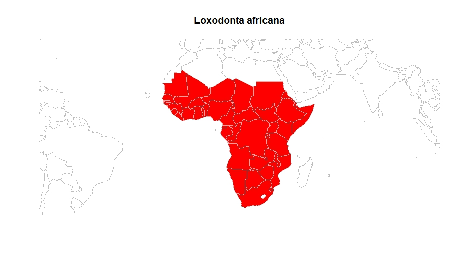

# citesr
[](https://travis-ci.org/ibartomeus/citesr)

An R package to access the CITES Species+ database (https://speciesplus.net/)

# How it works so far.

This is in-develpoment but you can already query species or taxa:

```
devtools::install_github("ibartomeus/citesr")
library("citesr")
cnx <- sppplus_connect(token = "insert your token here")
# get CITES status for a species
sppplus_taxonconcept(cnx, query = "Loxodonta africana", appendix_only = TRUE)
# get all fields in nested list format
sppplus_taxonconcept(cnx, query = "Loxodonta africana", appendix_only = FALSE) 
# also works at higher order taxonomy
sppplus_taxonconcept(cnx, query = "Mamalia", appendix_only = TRUE)
# you can ask for distribution
taxon_distribution(cnx, query_taxon = 'Loxodonta africana', country_only = TRUE)
```


# Example

```R
library(rworldmap)
map1 <- taxon_distribution(cnx, query_taxon = 'Loxodonta africana', country_only = TRUE)
map2 <- joinCountryData2Map(map1, joinCode="ISO2", nameJoinColumn = "iso2", nameCountryColumn = "distribution")
mapCountryData(mapToPlot = map2, nameColumnToPlot = "taxon", mapRegion = "africa", mapTitle = "Loxodonta africana", addLegend = FALSE)
```



-------------------------------------------------------


# Resources

- [Hadley book](http://r-pkgs.had.co.nz/)
- [Semantic versioning](https://semver.org/)
- [Choose a license](https://choosealicense.com/)
- [Maelle talk](http://www.masalmon.eu/2017/12/11/goodrpackages/)


## To learn more about Travis / Appveyor and Codecov

- [Travis](https://docs.travis-ci.com/user/getting-started/)
- [Travis for R (community-maintained)](https://docs.travis-ci.com/user/languages/r/)
- [Appveyor](https://www.appveyor.com/docs/)
- [Codecov](https://codecov.io/)

NB: other similar tools does exist: for code integration see [this page](https://github.com/marketplace/category/continuous-integration)
and for code quality see [that one](https://github.com/marketplace/category/code-quality).

# Todo list

- [x] Figure out how the CITES API works!
- [x] write function for personal API: sppplus_connect
- [x] write function for access to taxon concept: sppplus_taxonconcept
- [x] Set Travis / AppVeyor / Code coverage up
- [x] Query by Taxon
- [x] Add warning when species do not exists.
- [x] unlist info nicely
- [ ] Better help
- [ ] vignette
- [ ] Add licence
- [ ] can we do a ping?
- expand to other APIs:
- [ ] taxon_cites_legislation
- [x] taxon_distribution
- [ ] taxon_eu_legislation
- [ ] taxon_references

# Contributors

- Jonas Geschke / Email: jonas.geschke@mfn-berlin.de / Git: JonasGeschke
- Marie-Bé Leduc/ Email: mledu050@uottawa.ca / Git: mbhleduc
- Kevin Cazelles / Email: kcazelle@uoguelph.ca / GitHub: KevCaz
- Ignasi Bartomeus / Email: nacho.bartomeus@gmail.com / GitHub: ibartomeus
- Yasmine Verzelen / Email: yasmine.verzelen@inbo.be / GitHub: Yasmine-Verzelen
