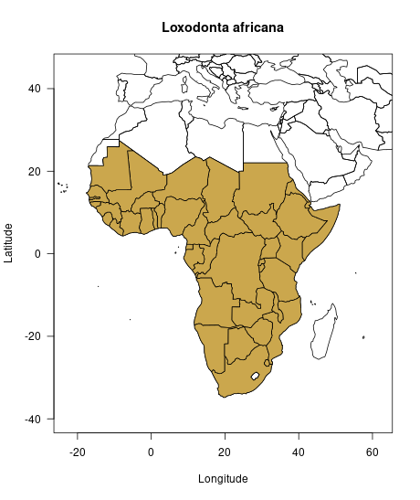

# Introduction and setup

In the vignettes "Get started with rcites", we explained how to get a token and
set it up for general access to the CITES Species+ database. Also, we very
briefly introduced to how to code the key features of `rcites`. With this
article, we aim to further introduce to the functionality and workflows of
`rcites`. For this, we use the African bush elephant (*Loxodonta africana*,
hereafter "elephant") as a case study. The elephant not only is a highly
endangered species that is illegally traded globally but also a flagship species
of nature conservation and the logo species of CITES.

We start with a basic set up: we load the package and set the token:


```r
library(rcites)
set_token("8QW6Qgh57sBG2k0gtt")
```

# Retrieve the taxon id

In order to access information about the elephant, we first need to retrieve its
Species+ taxon identifier. For this, we use the `spp_taxonconcept()` function
and the elephant's scientific name, *Loxodonta africana*, as `query_taxon` argument.


```r
elephant_taxonconcept <- spp_taxonconcept(query_taxon = "Loxodonta africana")
```

```
#>  ℹ Retrieving info from page 1 ........................ ✔
```

```r
elephant_taxonconcept
```

```
#>  
#>  ── General info - CITES ($general): ──────────────────────────────────────────────────────────────────────────────────
#>  # A tibble: 1 × 8
#>    id    full_name          author_year        rank    name_status updated_at          active cites_listing
#>    <chr> <chr>              <chr>              <chr>   <chr>       <dttm>              <lgl>  <chr>        
#>  1 4521  Loxodonta africana (Blumenbach, 1797) SPECIES A           2021-10-13 13:12:58 TRUE   I/II         
#>  
#>  ── Classification ($higher_taxa): ────────────────────────────────────────────────────────────────────────────────────
#>  # A tibble: 1 × 6
#>    id    kingdom  phylum   class    order       family      
#>    <chr> <chr>    <chr>    <chr>    <chr>       <chr>       
#>  1 4521  Animalia Chordata Mammalia Proboscidea Elephantidae
#>  
#>  ── Synonyms ($synonyms): ─────────────────────────────────────────────────────────────────────────────────────────────
#>  # A tibble: 1 × 4
#>       id full_name          author_year      rank   
#>    <int> <chr>              <chr>            <chr>  
#>  1 37069 Loxodonta cyclotis (Matschie, 1900) SPECIES
#>  
#>  ── Common names ($common_names): ─────────────────────────────────────────────────────────────────────────────────────
#>  # A tibble: 10 × 3
#>        id name               language
#>     <int> <chr>              <chr>   
#>   1  4521 Ndovo              SW      
#>   2  4521 Tembo              SW      
#>   3  4521 Haathi             UR      
#>   4  4521 Elefante           PT      
#>   5  4521 Slon               RU      
#>   6  4521 Elefant            NO      
#>   7  4521 Olifant            NL      
#>   8  4521 Afrikaanse olifant NL      
#>   9  4521 Elefante africano  ES      
#>  10  4521 afrikansk elefant  SV      
#>  -------truncated-------
#>  
#>  Information available: $all_id, $general, $higher_taxa, $accepted_names, $common_names, $synonyms, $cites_listings
```


As the first column of the output shows, the taxon identifier of the elephant is 4521. This `taxon_id` will be used for all next function coding.

Beyond the taxon identifier, the output also provides information about the taxon classification and other names, both synonyms and common names if any, in different languages.


## Map the elephant's distribution

Before giving more insights into the legislation status of the elephant, we have a look at where the elephant actually occurs naturally. For this, we can access the elephant's distribution information with the `spp_distributions()` function. Thereafter, we can map the distribution with the help of the `rworldmap` package.


```r
library(rworldmap)

par(las = 1)
elephant_distr <- spp_distributions(taxon_id = "4521",
                                    verbose = FALSE)$distributions

map2 <- joinCountryData2Map(elephant_distr,
                            joinCode="ISO2",
                            nameJoinColumn = "iso_code2",
                            nameCountryColumn = "name")
```

```
#>  42 codes from your data successfully matched countries in the map
#>  0 codes from your data failed to match with a country code in the map
#>  201 codes from the map weren't represented in your data
```

```r
plot(c(-23, 62), c(45, -40),
     type = "n",
     main = "Loxodonta africana",
     xlab = "Longitude",
     ylab = "Latitude")
plot(map2, add = TRUE)
plot(map2[!is.na(map2$iso_code2),], col = "#cba74d", add = TRUE)
```




## Access the legislation status

The functions `spp_cites_legislation()` and `spp_eu_legislation()` provide access to
the legislation status information of the elephant.

First, we have a look at the CITES legislation status:


```r
elephant_cites <- spp_cites_legislation(taxon_id = "4521")
```

```
#>  ℹ Now processing taxon_id '4521'...................... ✔
```

```r
elephant_cites
```

```
#>  
#>  ── Cites listings ($cites_listings): ─────────────────────────────────────────────────────────────────────────────────
#>  # A tibble: 10 × 6
#>     id    taxon_concept_id is_current appendix change_type effective_at
#>     <chr> <chr>            <lgl>      <chr>    <chr>       <chr>       
#>   1 30344 4521             TRUE       I        +           2017-01-02  
#>   2 30115 4521             TRUE       II       +           2019-11-26  
#>   3 32160 4521             TRUE       II       R+          2019-11-26  
#>   4 32161 4521             TRUE       II       R+          2019-11-26  
#>   5 32156 4521             TRUE       II       R+          2019-11-26  
#>   6 32158 4521             TRUE       II       R+          2019-11-26  
#>   7 32154 4521             TRUE       II       R+          2019-11-26  
#>   8 32159 4521             TRUE       II       R+          2019-11-26  
#>   9 32157 4521             TRUE       II       R+          2019-11-26  
#>  10 32155 4521             TRUE       II       R+          2019-11-26  
#>  
#>  ── Cites quotas ($cites_quotas): ─────────────────────────────────────────────────────────────────────────────────────
#>  # A tibble: 10 × 10
#>     id    taxon_concept_id quota publication_date public_display is_current unit  geo_entity.iso_code2 geo_entity.name 
#>     <chr> <chr>            <chr> <chr>            <lgl>          <lgl>      <chr> <chr>                <chr>           
#>   1 25337 4521             0     2021-02-03       TRUE           TRUE       <NA>  KE                   Kenya           
#>   2 25348 4521             0     2021-02-03       TRUE           TRUE       <NA>  LR                   Liberia         
#>   3 25355 4521             0     2021-02-03       TRUE           TRUE       <NA>  MW                   Malawi          
#>   4 25358 4521             0     2021-02-03       TRUE           TRUE       <NA>  ML                   Mali            
#>   5 25375 4521             0     2021-02-03       TRUE           TRUE       <NA>  MZ                   Mozambique      
#>   6 25390 4521             0     2021-02-03       TRUE           TRUE       <NA>  AO                   Angola          
#>   7 25414 4521             0     2021-02-03       TRUE           TRUE       <NA>  NE                   Niger           
#>   8 25431 4521             0     2021-02-03       TRUE           TRUE       <NA>  NG                   Nigeria         
#>   9 25554 4521             100   2021-02-03       TRUE           TRUE       <NA>  TZ                   United Republic…
#>  10 25555 4521             300   2021-02-03       TRUE           TRUE       <NA>  ZA                   South Africa    
#>  # … with 1 more variable: geo_entity.type <chr>
#>  -------truncated-------
#>  Field(s) not printed:  notes, url 
#>  
#>  ── Cites suspensions ($cites_suspensions): ───────────────────────────────────────────────────────────────────────────
#>  # A tibble: 10 × 8
#>     id    taxon_concept_id start_date is_current applies_to_import geo_entity.iso_code2 geo_entity.name geo_entity.type
#>     <chr> <chr>            <chr>      <lgl>      <lgl>             <chr>                <chr>           <chr>          
#>   1 17621 4521             2014-08-11 TRUE       TRUE              US                   United States … COUNTRY        
#>   2 17620 4521             2014-08-11 TRUE       TRUE              US                   United States … COUNTRY        
#>   3 17686 4521             2014-10-10 TRUE       TRUE              US                   United States … COUNTRY        
#>   4 18709 4521             2010-08-16 TRUE       TRUE              ZW                   Zimbabwe        COUNTRY        
#>   5 15983 <NA>             2011-01-19 TRUE       FALSE             DJ                   Djibouti        COUNTRY        
#>   6 22079 <NA>             2018-01-30 TRUE       FALSE             DJ                   Djibouti        COUNTRY        
#>   7 22076 <NA>             2018-01-22 TRUE       FALSE             LR                   Liberia         COUNTRY        
#>   8 22132 4521             2018-03-19 TRUE       FALSE             AU                   Australia       COUNTRY        
#>   9 23168 <NA>             2019-07-04 TRUE       FALSE             SO                   Somalia         COUNTRY        
#>  10 24947 4521             2020-05-26 TRUE       TRUE              CN                   China           COUNTRY        
#>  -------truncated-------
#>  Field(s) not printed:  notes, start_notification.name, start_notification.date, start_notification.url
```


We can do the same for the elephant's legislation status in the European Union:


```r
elephant_eu <- spp_eu_legislation(taxon_id = "4521")
```

```
#>  ℹ Now processing taxon_id '4521'...................... ✔
```

```r
elephant_eu
```

```
#>  
#>  ── EU listings ($eu_listings): ───────────────────────────────────────────────────────────────────────────────────────
#>  # A tibble: 2 × 6
#>    id    taxon_concept_id is_current annex change_type effective_at
#>    <chr> <chr>            <lgl>      <chr> <chr>       <chr>       
#>  1 31788 4521             TRUE       A     +           2019-12-14  
#>  2 31876 4521             TRUE       B     +           2019-12-14  
#>  
#>  ── EU decisions ($eu_decisions): ─────────────────────────────────────────────────────────────────────────────────────
#>  # A tibble: 10 × 15
#>     id    taxon_concept_id start_date is_current eu_decision_type… eu_decision_type… geo_entity.iso_c… geo_entity.name 
#>     <chr> <chr>            <chr>      <lgl>      <chr>             <chr>             <chr>             <chr>           
#>   1 26285 4521             2015-04-09 TRUE       Positive          POSITIVE_OPINION  ZW                Zimbabwe        
#>   2 25508 4521             2014-09-03 TRUE       Positive          POSITIVE_OPINION  BW                Botswana        
#>   3 11682 4521             2012-02-23 TRUE       Positive          POSITIVE_OPINION  NA                Namibia         
#>   4 24825 4521             2014-05-28 TRUE       Positive          POSITIVE_OPINION  ZA                South Africa    
#>   5 27017 4521             2015-09-15 TRUE       Positive          POSITIVE_OPINION  ZM                Zambia          
#>   6 27360 4521             2016-06-27 TRUE       Negative          NEGATIVE_OPINION  MZ                Mozambique      
#>   7 35567 4521             2020-03-03 TRUE       <NA>              <NA>              MZ                Mozambique      
#>   8 30377 4521             2017-06-21 TRUE       Negative          NEGATIVE_OPINION  TZ                United Republic…
#>   9 30553 4521             2017-06-21 TRUE       Positive          POSITIVE_OPINION  TZ                United Republic…
#>  10 32143 4521             2019-10-17 TRUE       Suspension (a)    SUSPENSION        CM                Cameroon        
#>  # … with 7 more variables: geo_entity.type <chr>, start_event.name <chr>, start_event.date <chr>, source.code <chr>,
#>  #   source.name <chr>, term.code <chr>, term.name <chr>
#>  Field(s) not printed:  notes, eu_decision_type.description, start_event.url
```


With the combination of `map2` and the legislation data, one might be able to illustrate the elephant's trade directions. This and other use examples of the `rcites` data output will be added bit by bit.


## Access the elephant's Species+ reference data

Last but not least, it is important to identify which references the Species+ information about the elephant is based on. For this, we can access the Species+ reference data with the `spp_references()` function.


```r
elephant_refs <- spp_references(taxon_id = "4521", verbose = FALSE)
elephant_refs
```

```
#>  
#>  ── References ($references): ─────────────────────────────────────────────────────────────────────────────────────────
#>  # A tibble: 10 × 3
#>     id    citation                                             is_standard
#>     <chr> <chr>                                                <chr>      
#>   1 10265 Anon. 1978. Red data book: Mammalia. IUC [truncated] FALSE      
#>   2 6344  Barnes, R. F., Agnagna, M., Alers, M. P. [truncated] FALSE      
#>   3 17013 Blanc, J.J., Thouless, C.R., Hart, J.A., [truncated] FALSE      
#>   4 6371  Burton, M. P. 1994. Alternative projecti [truncated] FALSE      
#>   5 6532  Douglas-Hamilton, I. 1987. African Eleph [truncated] FALSE      
#>   6 6534  Douglas-Hamilton, I. 1987. African Eleph [truncated] FALSE      
#>   7 6825  Jackson, P. 1982. Elephants and rhinos i [truncated] FALSE      
#>   8 7224  Meester, J. and Setzer, H. W (eds.) 1974 [truncated] FALSE      
#>   9 7609  Parker, I. and Amin, M. 1983. Ivory cris [truncated] FALSE      
#>  10 19397 Parker, I.S.C. and Martin, E.B. 1982. Ho [truncated] FALSE      
#>  -------truncated-------
```

```r
dim(elephant_refs$references)
```

```
#>  [1] 15  3
```
